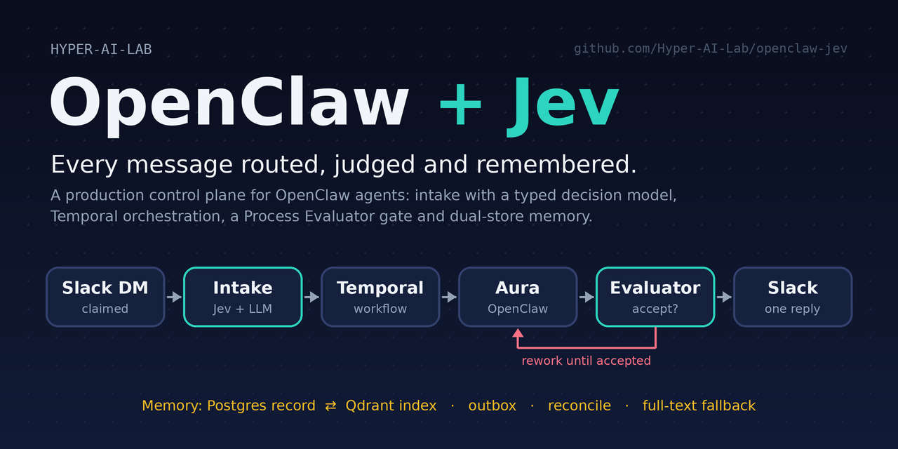
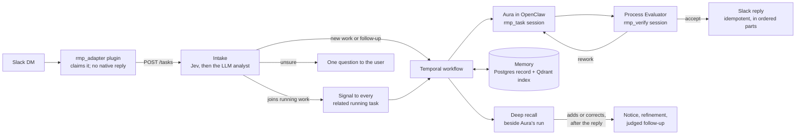

# OpenClaw + Jev



[](https://github.com/Hyper-AI-Lab/openclaw-jev/actions/workflows/ci.yml)
[](LICENSE)
[](requirements.txt)
[](https://github.com/openclaw/openclaw)
[](https://temporal.io)

**A production control plane for [OpenClaw](https://github.com/openclaw/openclaw) agents.** Every Slack message is routed to the work it belongs to, executed as a durable Temporal workflow, judged by a separate evaluator before anything reaches the user, and remembered in a deep, searchable memory that the agent consults while it answers. Routing decisions use [Jev](https://docs.typesafe.ai/api), TypeSafe's typed decision model, with an LLM analyst for the cases Jev is unsure about.

OpenClaw stays the execution engine (model, tools, sessions). This repository is the layer around it, called the RMP (Reliability and Memory Plane): it owns intake, orchestration, judgment, memory and delivery. It runs Aura, a personal assistant on Slack, in production.

Built by [Hyper-AI-Lab](https://github.com/Hyper-AI-Lab) · [hyperailab.com](https://hyperailab.com/)

---

## Why

An agent runtime is good at models and tools. Left alone, it is weak at the things an always-on assistant needs:

- A follow-up message starts a fresh conversation instead of joining the task it belongs to.
- "Done" means the model said so, not that the work was checked.
- A crash between the answer and the Slack post loses the answer, or sends an unchecked one.
- Memory is one global pile, or it silently drifts out of sync with its index.
- Rate limits, stalls and runaway contexts are found on the bill.

OpenClaw + Jev closes those gaps without forking OpenClaw: a plugin claims every message, and everything after that is program-owned.

## What happens to a message



1. **Claim.** The `rmp_adapter` OpenClaw plugin claims the DM (text, Slack message id, thread and reply-to ids, attachments) and posts it to the RMP API. OpenClaw never answers on its own; if the API is down, the message stays claimed and the user gets an RMP notice.
2. **Intake.** Deterministic gates first (duplicates, recurring jobs, health checks), then a hybrid evidence pack (full-text and vector search over running tasks, finished tasks and memory, plus the recent dialogue). Jev answers typed questions about the message; below its thresholds the LLM analyst decides. The outcome is one of: attach to running work (to *every* related running task), a follow-up of finished work, a new task, a clarifying question, or a short acknowledgement.
3. **Orchestrate.** A Temporal workflow runs a program-owned plan. Step completion is decided by code predicates on structured output, not by the model saying it is done. Seven catalog templates (registration, login, email verification, procurement, outreach, browser automation, tool self-upgrade) cover repeatable processes; everything else runs as a generic plan.
4. **Execute.** Aura works in an isolated OpenClaw session with her tools and one memory block, assembled once by the Internal Agent (IA): the recent dialogue, relevant facts, linked tasks and the run's own memory. Beside her, the IA runs a deep recall over everything remembered and writes a cited context report. If the report is ready in time, Aura's later steps and the evaluator use it.
5. **Judge.** A separate Process Evaluator, in its own session, sees the request, the draft, Aura's action trace (tool calls and their results) and the run's artifacts. It accepts or sends a specific correction back. Attempts 1–9 are reworks, attempt 10 changes strategy, and at attempt 20 the user gets a diagnosis instead of a guess. Messages that arrive meanwhile are folded into the draft, which is judged again.
6. **Deliver.** Only an accepted reply is posted, once, in ordered parts of at most 3,500 characters. Transient Slack errors retry; a permanent refusal is recorded, alerted, and ends the task `failed` with that reason. Messages that arrive after the reply go back to intake as new requests.
7. **Follow up.** If the recall report arrives after the reply and the IA judges that it adds to or corrects what Aura said, the user hears that she recalled more. She refines her answer, the evaluator judges it, and only an accepted follow-up is sent. At most one per task.

## What you get

| Area | Guarantee |
| --- | --- |
| **Routing** | Every message becomes a task or a follow-up; none is dropped. A message related to several running tasks reaches all of them. Retrieval is evidence for the analyst, never the decision. |
| **Judgment** | Nothing unjudged reaches Slack: not a recovered draft after a crash, not a draft held by an evaluator outage (the run waits for the evaluator on durable timers and tells the user it is still working). Whether an answer is good enough is the evaluator's call, never a length rule. |
| **Durability** | Temporal workflows survive restarts. A reconciler restarts dead runs so their drafts are judged, closes process runs whose task already ended, and re-signals stalled work. |
| **Memory** | Postgres is the record; Qdrant is its index, kept in step by a transactional outbox, a 15-second drain and a daily reconcile. When the index does not answer, recall falls back to Postgres full-text search. Conversations, task histories, deliverables and the pages the agent read are ingested in the background into a hybrid (dense + BM25) index with summaries, context headers and dated facts. |
| **Two-phase answering** | The first answer never waits for deep recall. A report that arrives later leads to a follow-up only when it adds or corrects, and the follow-up is judged like any reply. |
| **Hygiene** | Canary, heartbeat and system runs never reach shared memory or the task registry. Procedural memory holds procedures (steps, tools, failures), not replies. |
| **LLM operations** | `openai/gpt-6-luna` over the OpenAI Responses API with `store: false`, thinking `max` for Aura's task work and `medium` elsewhere, `nvidia/openai/gpt-oss-20b` as fallback with balanced key rotation. Idle calls fail fast and rotate. A quota broker caps concurrent runs (3 user slots and 1 canary slot) and gives intake its own lane. |
| **Monitoring** | A readiness API with deep-memory checks (ingest lag, enrichment, index drift, the memory model budget, recall latency and follow-up rate) coding checks (Claude Code, isolation, jobs), and twelve invariant checks: completions without an evaluator accept, attached messages neither answered nor resubmitted, Slack delivery failures, internal traces in shared memory, a stuck vector outbox, orphaned runs, finished tasks without their memory document, internal content in deep memory, follow-ups without an accept, coding changes shipped without Kirill's confirmed approval, self-deploys without a verification record, and Claude Code units without a live task. A sentinel pages the operator by Slack DM when one breaks. |
| **Coding** | Claude Code is Aura's tool in any task. She talks to it turn by turn in direct sessions: RMP runs them as root, Opus for planning turns and Sonnet in Claude's auto permission mode for the work, in a clone of her repository or a scratch folder, records them in full in memory, and stops them with her runs. Files Claude makes go to Kirill with her accepted reply. Her code reaches GitHub's protected `main` only through pull requests whose CI test check passed. Claude merges once she approves; RMP then deploys GitHub's `main` once CI passed on it and she is idle (restarting only what changed, checking health, readiness and a canary, reverting on failure) and sends Kirill a note. A reviewed coding job, when Kirill asks for one, runs Claude Code as `aura-coder` in an isolated checkout; RMP runs the tests, Aura and the evaluator review each round, and nothing ships before Kirill approves in Slack; it then lands through a pull request too. Other repositories are off limits unless Kirill says otherwise for a change. |
| **Web research** | Search (Brave, LangSearch), readers (Jina), crawlers and extractors (Crawl4AI, Scrapling, Crawlee, ScrapeGraphAI), and browsers (OpenClaw `browser`, browser-use, Obscura CDP), picked per situation. |

## Memory

| Layer | What it holds | How it is used |
| --- | --- | --- |
| Dialogue | Every message and reply (`task_messages`, with kind, session and Slack metadata) | The last four tasks of the same Slack conversation are shown to Aura and to intake as RECENT DIALOGUE |
| Task registry | Each finished task's request, outcome and answer, in Postgres and Qdrant | Intake searches it to recognise follow-ups of finished work |
| Process memory | Episodic and working notes of one run | Injected into that run's steps and reworks |
| Deep memory | One document per task (conversation, path through the system, deliverables, actions), long deliverables, pages and files the agent read, text attachments: sections with summaries, chunks with context headers and a table-of-contents pointer | Searched by the IA's deep recall; the report reaches Aura and the evaluator |
| Facts | Atomic facts from conversations, dated; an update supersedes the old fact and a contradiction is linked, nothing is deleted | In the fast context when relevant, and with their history in deep recall |
| Procedural memory | How similar work was done: steps, tools, failed calls | Retrieved for the same kind of process |

Each memory row commits together with its outbox entry; the drain then writes the vector and retries a failed embedding instead of losing it, and a nightly reconcile repairs any drift between the stores. The IA's model work (summaries, context headers, facts, recall, novelty) calls the OpenAI Responses API directly (`gpt-6-luna`, reasoning `medium`, `store: false`) under its own concurrency limits and daily token budget.

## Jev

[Jev](https://docs.typesafe.ai/api) (`jev-1.13.0`, pinned) is TypeSafe's typed decision model. It answers multiple-choice questions with calibrated confidence in one HTTPS call, without an agent session. This project uses it for two decisions only, never for chat, for judging answers, or for choosing models:

- **Intake.** Typed questions per message: how it relates to running and finished work, which task, which execution mode, whether a catalog template applies, what kind of web work it needs, and whether answering needs a search of long-term memory. An answer counts only above program thresholds (0.85, and 0.92 to attach to a running task). Below them, the LLM analyst decides. Either way, the program's intake policy has the final say.
- **Memory promotion.** Three typed questions per candidate fact (support, durability, scope), at 0.95, before anything becomes long-term memory.

Each consumer runs `off`, `shadow` (record Jev's proposal, act on the existing path) or `enforce`. On the production host, intake is in `enforce` after passing an evaluation gate (zero harmful errors, accuracy of at least 0.9, coverage of at least 0.5, p95 under 1.5 s), and promotion is in `shadow`. See the [Jev runbook](docs/runbooks/jev.md).

## Quick start

### Prerequisites

- Linux, Python 3.12, and Node.js 24.16+ (OpenClaw 2026.9.7 supports 24.16+ on 24.x, or 26.1+)
- [OpenClaw](https://github.com/openclaw/openclaw) 2026.9 gateway with Slack configured
- PostgreSQL, a [Temporal](https://temporal.io) server and [Qdrant](https://qdrant.tech)
- An OpenAI API key (chat, the IA's memory work, and `text-embedding-3-small` / `text-embedding-3-large` embeddings); NVIDIA API keys for the fallback model are optional
- Optional: a TypeSafe API key for Jev; Brave and LangSearch keys for web search

### Setup

```bash
git clone https://github.com/Hyper-AI-Lab/openclaw-jev.git
cd openclaw-jev
python3 -m venv venv && source venv/bin/activate
pip install -r requirements.txt

cp settings.example.json settings.json
# Set api_key, production.slack_owner_user_id, vector_memory, task_registry and jev.

# Link plugins/rmp_adapter, plugins/aura_web and plugins/langsearch into OpenClaw's
# plugins.load.paths, then patch and verify the OpenClaw dist:
bash patch_openclaw.sh
bash ops/verify_openclaw_patch.sh

# Run the API (uvicorn app.api.server:app) and the worker (python worker.py) under
# systemd or your process manager, then:
make production-check
```

Keep secrets out of the repository: `settings.json`, `.env` files, auth profiles and `data/` are git-ignored. OpenClaw's model keys live in its own environment file.

### Operations

```bash
make production-check   # health, OpenClaw patch check, intake canaries
make readiness          # readiness report, invariant checks included
make canary             # end-to-end canary task
make restart-rmp        # restart API, worker and gateway; waits for health
make upgrade-openclaw   # after every OpenClaw update: re-apply and verify patches
bash ops/rollback_openclaw.sh   # back to the version and data from before the last upgrade
curl -H "X-RMP-API-Key: $KEY" localhost:8000/api/deep_memory/status   # deep memory at a glance
venv/bin/python -m ops.reconcile_vectors [--apply]   # compare Postgres with Qdrant
venv/bin/python -m pytest tests/ -q                  # hermetic: private SQLite, sealed network
node --test tests/node/*.test.js                     # plugin tests
```

## Testing

- **Unit and integration tests** for intake, workflows, the evaluator, memory, delivery, the quota broker, readiness and the invariants. Tests always run on a private SQLite database.
- **Whole-path harness** (`tests/test_whole_path.py`): a Slack message goes through `POST /tasks`, intake, the task workflows, the real activities and evaluator code, and Slack delivery on a time-skipping Temporal server. Only the models, Aura's session and Slack's HTTP API are stubbed, and any other network access fails the test.
- **Two-phase harness** (`tests/test_two_phase_answering.py`): deep recall ready before the judgment, adds, corrects, nothing new, failure, timeouts, a stop or a message during the wait, internal tasks and the kill switches. Recorded workflow histories must replay on the current code (`tests/test_workflow_replay.py`).
- **Plugin tests** call every OpenClaw tool the way OpenClaw 2026.9 does.

## Repository layout

```text
app/
  api/            FastAPI: tasks, intake, settings, readiness, dashboard
  workflows/      Temporal workflows: generic, catalog, intake, deep recall, judgment, attached messages
  activities/     OpenClaw dispatch, Slack delivery, database, memory and deep recall activities
  task_registry/  Intake: evidence, handlers, retrieval, registry
  decisions/      Jev consumers (intake, memory promotion)
  deep_memory/    Hybrid index, ingestion, enrichment, facts, fast context, deep recall, health
  memory/         Memory router, vector sync (outbox, reconcile), promotion, hygiene
  orchestrator/   Step predicates, rework rules, Process Evaluator
  llm/            Direct OpenAI client for the IA, quota broker, model policy, usage monitor
  production/     Readiness, invariants, canary sentinel, ops alerts
  reconciler.py   Orphan recovery, stale-work repair, process-run closing
plugins/          rmp_adapter (Slack claim), aura_web (web tools), langsearch
web-stack/        Local web backends (crawl, scrape, extract, browser)
ops/              Canaries, backups, reconcile, OpenClaw upgrade and patch checks
tests/            pytest suite, whole-path harness, node plugin tests
docs/             Constitution, runbooks, audit log
worker.py         Temporal worker
```

## Documentation

- [`ARCHITECTURE.md`](ARCHITECTURE.md): how the system is built, service by service
- [`docs/CONCEPT_TREE.md`](docs/CONCEPT_TREE.md): what must stay true, and why
- [`docs/runbooks/`](docs/runbooks/): Jev, invariant alerts, OpenClaw upgrades, backups, go-live, Slack sockets
- [`docs/SYSTEM_AUDIT_PROGRESS.md`](docs/SYSTEM_AUDIT_PROGRESS.md): the September 2026 end-to-end audit and hardening
- [`docs/DEEP_MEMORY_PROGRESS.md`](docs/DEEP_MEMORY_PROGRESS.md): deep memory and two-phase answering, step by step

## Status

Runs in production on a single VPS (OpenClaw 2026.9, one Temporal server, Postgres and Qdrant on the same host). This repository is a public snapshot of that deployment: host paths, ports and systemd units reflect it and need adapting to yours.

## Contributing

See [`CONTRIBUTING.md`](CONTRIBUTING.md). Issues and pull requests are welcome, especially for portable packaging, docs and tests.

## Acknowledgements

[OpenClaw](https://github.com/openclaw/openclaw) (agent runtime), [TypeSafe Jev](https://docs.typesafe.ai/api) (decision model), [Temporal](https://temporal.io) (durable execution), [Qdrant](https://qdrant.tech) (vector index).

## License

[MIT](LICENSE) © Hyper-AI-Lab
